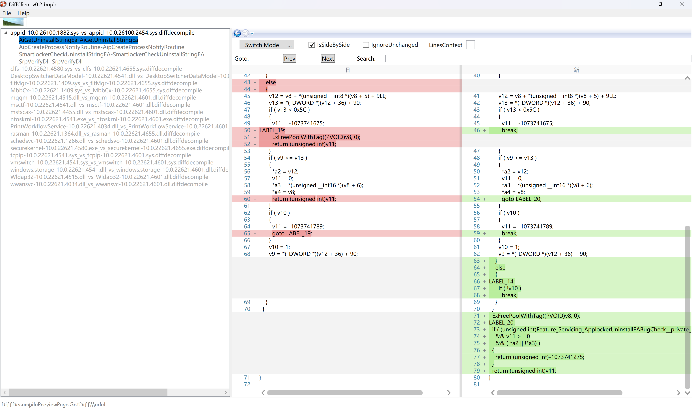
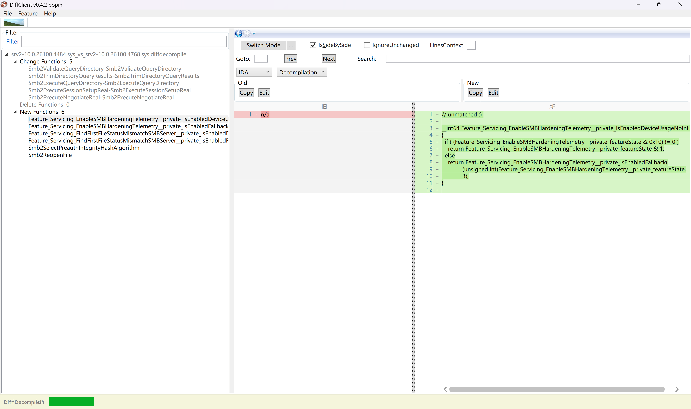

# DiffClient

DiffClient is a WPF Application for paring and show the binary decompilation diff from the .diffdecompile file. Another project repo store is  [diffdecompile](https://github.com/bopin2020/diffdecompile) which hosts some diff examples

## use

install .NET6 Desktop

## features

